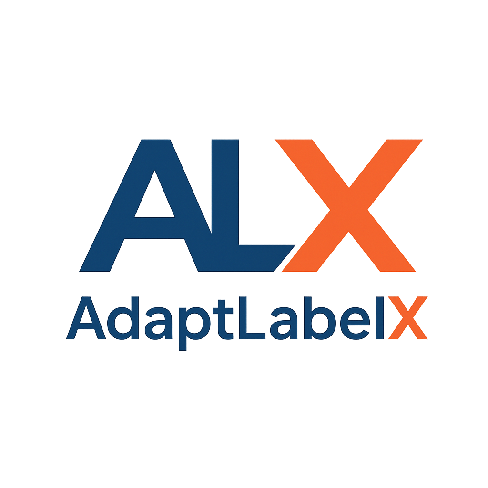

# 🚀 AdaptLabelX

**AdaptLabelX** é uma plataforma web inteligente para anotação automática de imagens, desenvolvida como um Trabalho de Conclusão de Curso (TCC). A ferramenta acelera o processo de rotulagem de datasets para visão computacional, permitindo que os usuários utilizem modelos de IA de ponta (como YOLOv8 e SAM) ou façam o upload dos seus próprios modelos customizados.

---

## 🎯 Sobre o Projeto

O gargalo no desenvolvimento de modelos de Visão Computacional é, frequentemente, a criação de datasets anotados. O AdaptLabelX resolve este problema ao fornecer uma interface de usuário simples onde é possível:
1.  Criar um dataset.
2.  Fazer o upload de imagens.
3.  Selecionar um modelo de IA (padrão ou customizado).
4.  Anotar automaticamente todas as imagens com um clique.
5.  Exportar as anotações em formatos padrão de mercado.

## ✨ Funcionalidades Principais

* **Autenticação de Usuário:** Sistema seguro de registro e login com tokens JWT.
* **Gerenciamento de Datasets:** Crie, visualize, atualize e delete os seus projetos de anotação.
* **Upload de Imagens:** Envio de múltiplas imagens em lote para um dataset.
* **Anotação Automática Inteligente:**
    * **YOLOv8 Detecção:** Utiliza o modelo `yolov8n.pt` para detecção de objetos (bounding boxes).
    * **YOLOv8 Segmentação:** Utiliza o `yolov8n-seg.pt` para segmentação de instâncias (polígonos).
    * **Segment Anything (SAM):** Utiliza o `sam_b.pt` combinado com o YOLO para segmentação de alta precisão.
* **Filtro de Classes:** Para os modelos padrão (YOLO/SAM), o usuário pode escolher quais das 80 classes do COCO ele deseja anotar (ex: "cat" e "dog").
* **Modelos Customizados:**
    * **Upload:** Faça o upload dos seus próprios modelos `.pt` treinados (ex: `yolov8nTeste001.pt`).
    * **Anotação:** Use os seus modelos customizados para anotar imagens (o sistema usa as classes nativas do seu modelo).
* **Exportação de Anotações:** Exporte o seu dataset completo nos formatos mais populares:
    * `YOLO (.txt)`
    * `COCO (.json)`
    * `LabelMe (.json)`
    * `CVAT (.xml)`

## 🛠️ Arquitetura

O projeto é totalmente containerizado usando Docker e é composto por dois serviços principais:

1.  **Backend (API):** Uma API RESTful robusta construída com **FastAPI** (Python), responsável pela lógica de negócio, interação com a IA (Ultralytics) e gerenciamento do banco de dados (PostgreSQL/Neon).
2.  **Frontend:** Uma Single Page Application (SPA) moderna e responsiva construída com **React** e **TypeScript**, servida através do **Nginx**.

---