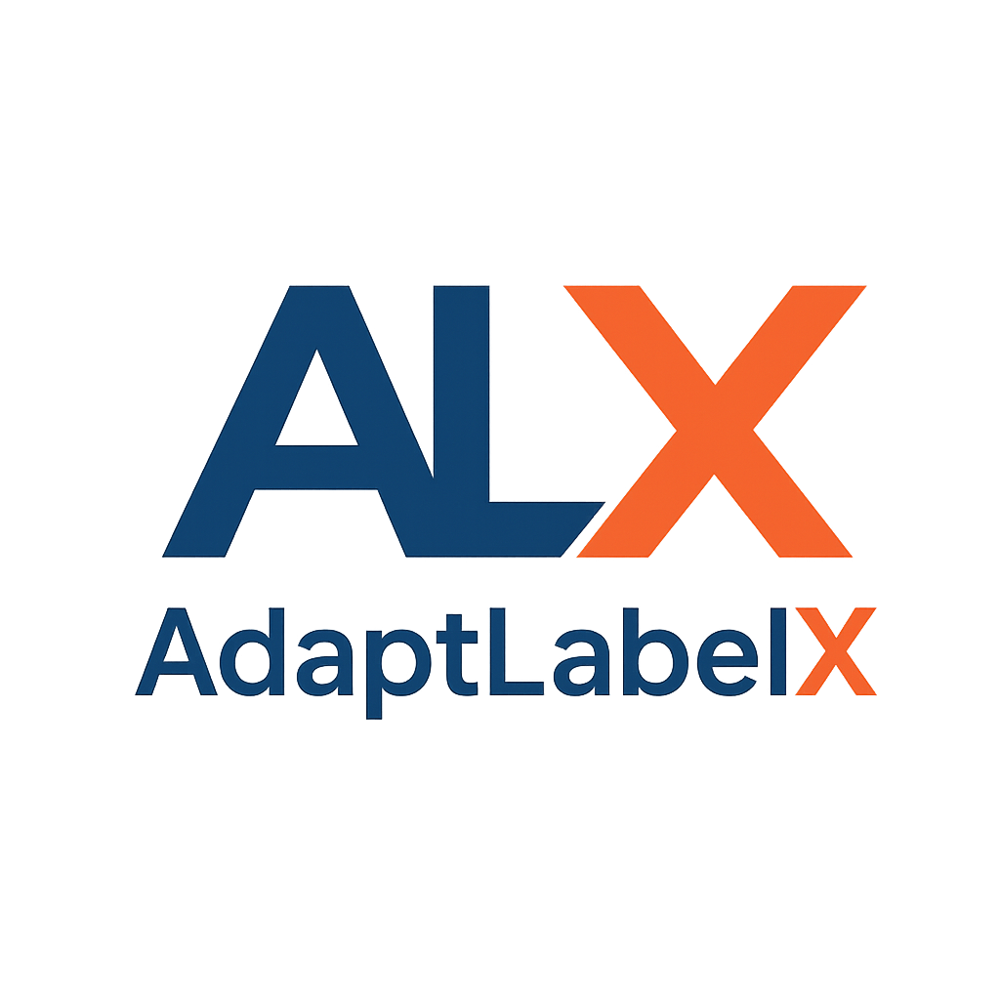

# 🚀 AdaptLabelX

  

**AdaptLabelX** It is an intelligent web platform for automatic image annotation, developed as a capstone project. The tool accelerates the dataset labeling process for computer vision, allowing users to utilize state-of-the-art AI models (such as YOLOv8 and SAM) or upload their own custom models.

---

## 🎯 About the Project

The bottleneck in Computer Vision model development is often the creation of annotated datasets. AdaptLabelX addresses this issue by providing a simple user interface that allows you to:
1.  Create a dataset.
2.  Upload images.
3.  Select an AI model (standard or custom).
4.  Automatically annotate all images with a single click.
5.  Export annotations in industry-standard formats.

## ✨ Key Features

* **User Authentication:** Secure registration and login system using JWT tokens.
* **Dataset Management:** Create, view, update, and delete your annotation projects.
* **Image Upload:** Batch upload multiple images to a dataset.
* **Intelligent Automatic Annotation:**
* **YOLOv8 Detection:** Uses the `yolov8n.pt` model for object detection (bounding boxes). 
* **YOLOv8 Segmentation:** Uses `yolov8n-seg.pt` for instance segmentation (polygons). 
* **Segment Anything (SAM):** Uses `sam_b.pt` combined with YOLO for high-precision segmentation.
* **Class Filtering:** For standard models (YOLO/SAM), users can select which of the 80 COCO classes they wish to annotate (e.g., "cat" and "dog").
* **Custom Models:**
* **Upload:** Upload your own trained `.pt` models (e.g., `yolov8nTeste001.pt`). 
* **Annotation:** Use your custom models to annotate images (the system utilizes your model's native classes).
* **Annotation Export:** Export your complete dataset in popular formats:
* `YOLO (.txt)`
* `COCO (.json)`
* `LabelMe (.json)`
* `CVAT (.xml)`
  
## 🛠️ Architecture

The project is fully containerized using Docker and consists of two main services:

1. **Backend (API):** A robust RESTful API built with **FastAPI** (Python), responsible for business logic, interaction with AI (Ultralytics), and database management (PostgreSQL/Neon).

2. **Frontend:** A modern and responsive Single Page Application (SPA) built with **React** and **TypeScript**, served through **Nginx**.

---
